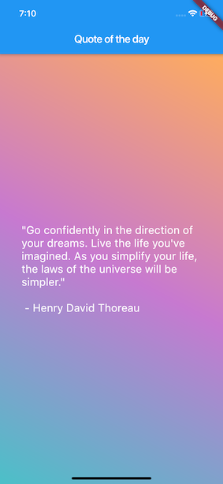

# QOD

QOD is my first flutter app. I created this for exploring Flutter and Bloc design pattern.
This is very simple app that fetches random qoute from [
They Said So Quotes API](https://quotes.rest) and the quote is changing everyday. I also use this project to explore [Bloc](https://github.com/felangel/bloc) library to separate my presentation from business logic.

  - Basic Flutter UI
  - Bloc Design Pattern
  - Network Request
  - Parsing Network Request

### Source

- [Bloc](https://github.com/felangel/bloc)
- [Lab: Write your first Flutter app](https://flutter.dev/docs/get-started/codelab)
- [Cookbook: Useful Flutter samples](https://flutter.dev/docs/cookbook)

For help getting started with Flutter,
[online documentation](https://flutter.dev/docs), which offers tutorials,
samples, guidance on mobile development, and a full API reference.
